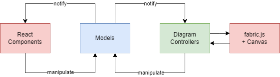

# Mini Petri Net

Mini Petri Net simulates a [petri net](https://en.wikipedia.org/wiki/Petri_net) on your browser.
Petri nets have a multitude of application in fields like reliability engineering, process control and many more!

## Running the App

The project uses [create-react-app](https://reactjs.org/docs/create-a-new-react-app.html) and commands 
standard to the framework can be used to run and deploy the app.

### `npm start`

Runs the app in the development mode.\
Open [http://localhost:3000](http://localhost:3000) to view it in your browser.

### `npm test`

Launches the test runner in the interactive watch mode.\
See the section about [running tests](https://facebook.github.io/create-react-app/docs/running-tests) for more information.

### `npm run build`

Builds the app for production to the `build` folder.\
See the section about [deployment](https://facebook.github.io/create-react-app/docs/deployment) for more information.

## Architecture

The application follows the following architecture.

The canvas and fabric.js data flow is similar to the MVVM architecture and is
implemented largely with rich classes.

React, however, must work with immutable data so data from the models are first
"projected" into immutable objects prior to consumption in React components.
These projections occur in hooks like `usePlace` and `useTransition`.